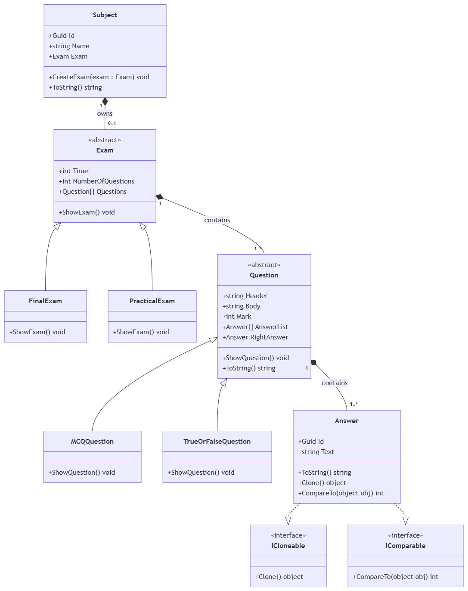
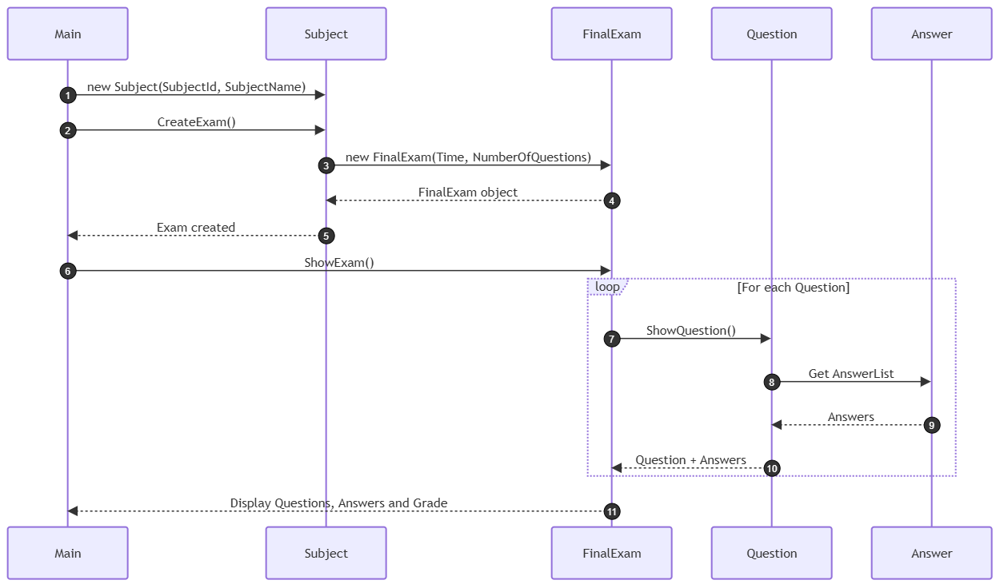

# Examination System

A C# console-based Examination System designed to demonstrate core Object-Oriented Programming concepts through a simple examination domain.

## Overview

The system supports two types of examinations:

- Final Exam
- Practical Exam

It also supports different question types:

- True / False
- Multiple Choice Question (MCQ)

The system models the relationships between Subjects, Exams, Questions, and Answers while applying fundamental OOP principles in C#.

## OOP Concepts

- Encapsulation
- Abstraction
- Inheritance
- Polymorphism
- Composition
- Interfaces
- Method Overriding
- Constructor Chaining

Additional C# features demonstrated:

- `ICloneable`
- `IComparable`
- `ToString()` overriding

## Domain Model

```text
Subject
   │
   └── Exam
         │
         └── Questions[]
               │
               └── Answers[]
```

### Inheritance

```text
Exam
├── FinalExam
└── PracticalExam

Question
├── MCQQuestion
└── TrueOrFalseQuestion
```

`FinalExam` and `PracticalExam` inherit from the abstract `Exam` class.

`MCQQuestion` and `TrueOrFalseQuestion` inherit from the abstract `Question` class.

This allows common behavior to be defined in the base classes while specialized behavior is implemented in the derived classes.

## Design Decisions

### Composition vs. Aggregation

The relationship type was chosen according to the business rules of this system rather than simply because one class contains another.

### Exam → Question

In a general examination platform, `Exam` and `Question` could be modeled using **Aggregation** if questions were managed independently through a reusable question bank and could be shared between multiple exams.

For example:

```text
Question Bank
   ├── Q1
   ├── Q2
   └── Q3

Exam A ◇── Q1
Exam B ◇── Q1
```

In this project, the business case represents an exam as containing its own `Question[]`, without introducing an independent question bank or a shared question lifecycle.

Therefore, `Exam → Question` is modeled as **Composition** in this design.

```text
Exam ◆── Question
```

### Question → Answer

The business case defines a question as being associated with an array of answers:

```csharp
Answer[] AnswerList
```

These answers represent the choices belonging to that specific question, and the requirements do not introduce an independent answer bank or reusable answer lifecycle.

Therefore, `Question → Answer` is modeled as **Composition**.

```text
Question ◆── Answer[]
```

### Subject → Exam

The `Subject` contains its associated exam and provides the functionality to create that exam.

Therefore, `Subject → Exam` is modeled as **Composition** in this design.

```text
Subject ◆── Exam
```

> Relationship types are domain-dependent design decisions. The same pair of classes can have different relationships in different business domains.

## UML Diagrams

### Class Diagram



### Sequence Diagram



The editable draw.io source is also included:

`Docs/ExaminationSystem.drawio`

The source file contains both the Class Diagram and Sequence Diagram.

## Key Classes

### Subject

Represents a subject and maintains its associated examination.

### Exam

An abstract base class containing the common examination properties and behavior:

- Exam time
- Number of questions
- Questions list
- `ShowExam()` functionality

### FinalExam

Supports:

- True / False questions
- MCQ questions

After completing the exam, it displays the questions, answers, and grade.

### PracticalExam

Supports:

- MCQ questions

After completing the exam, it displays the correct answers after finishing the exam.

### Question

An abstract base class containing the common properties shared by all question types:

- Header
- Body
- Mark
- Answer list
- Right answer

### Answer

Represents an answer choice and contains:

- Answer ID
- Answer text

## Interfaces

The project demonstrates:

- `ICloneable` for object cloning
- `IComparable` for comparison behavior

## Project Structure

```text
ExaminationSystem/
│
├── Docs/
│   ├── ExaminationSystem.drawio
│   ├── ExaminationSystem-ClassDiagram.png
│   └── ExaminationSystem-SequenceDiagram.png
│
├── src/
│   └── ExaminationSystem/
│       ├── Models/
│       │   ├── Answer.cs
│       │   ├── Exam.cs
│       │   ├── FinalExam.cs
│       │   ├── MCQQuestion.cs
│       │   ├── PracticalExam.cs
│       │   ├── Question.cs
│       │   ├── Subject.cs
│       │   └── TrueOrFalseQuestion.cs
│       │
│       ├── Program.cs
│       └── ExaminationSystem.csproj
│
├── .gitignore
├── ExaminationSystem.sln
└── README.md
```

## Purpose

This project was developed as an OOP exercise to practice object-oriented design, class relationships, abstraction, inheritance, polymorphism, composition, interface implementation, and C# object behavior.

The goal is to model the given business case clearly while keeping the design simple and maintainable.
